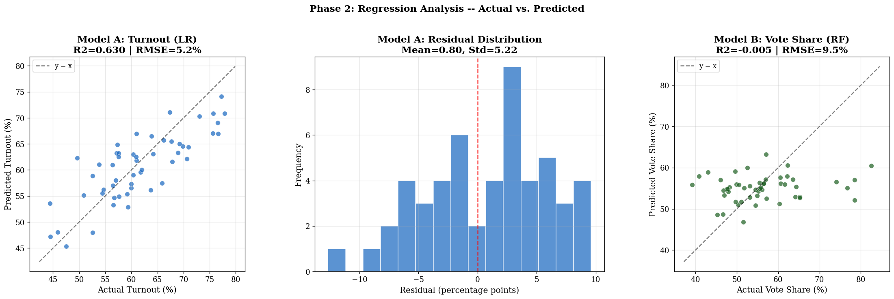
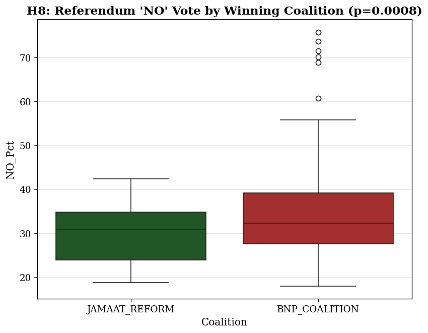
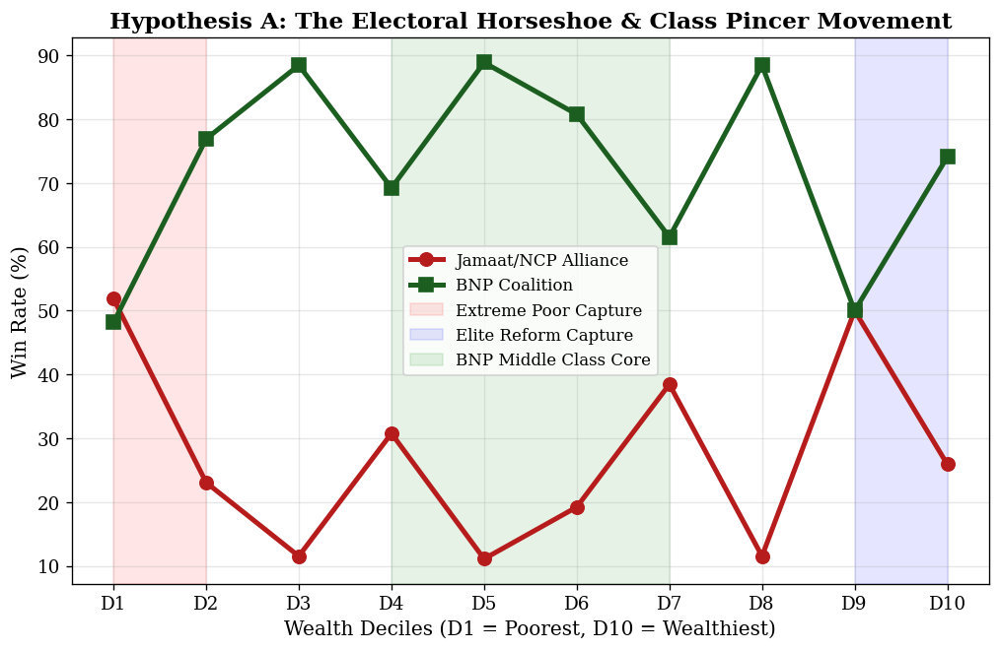
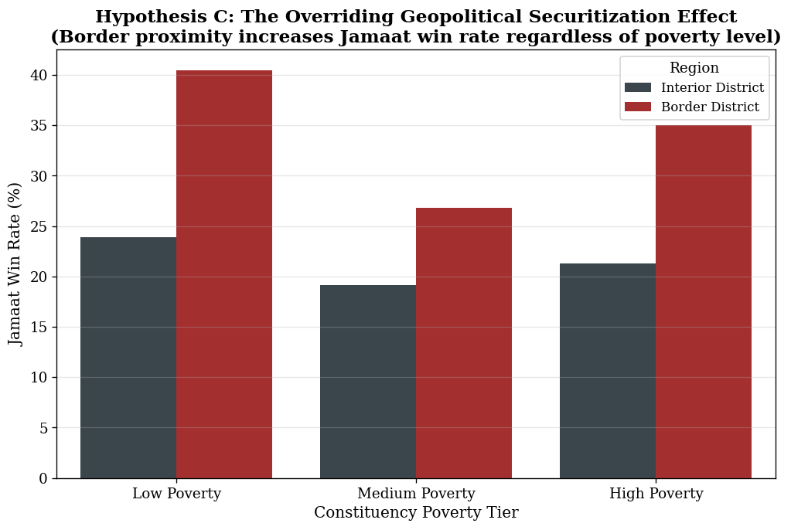
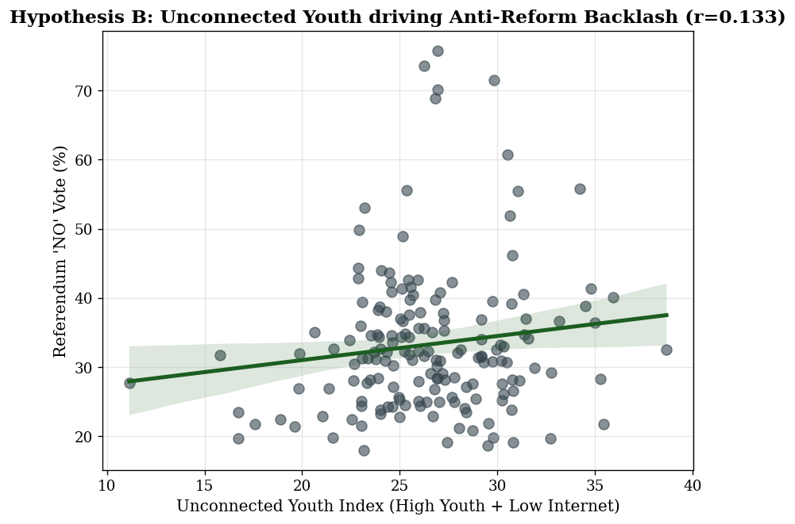
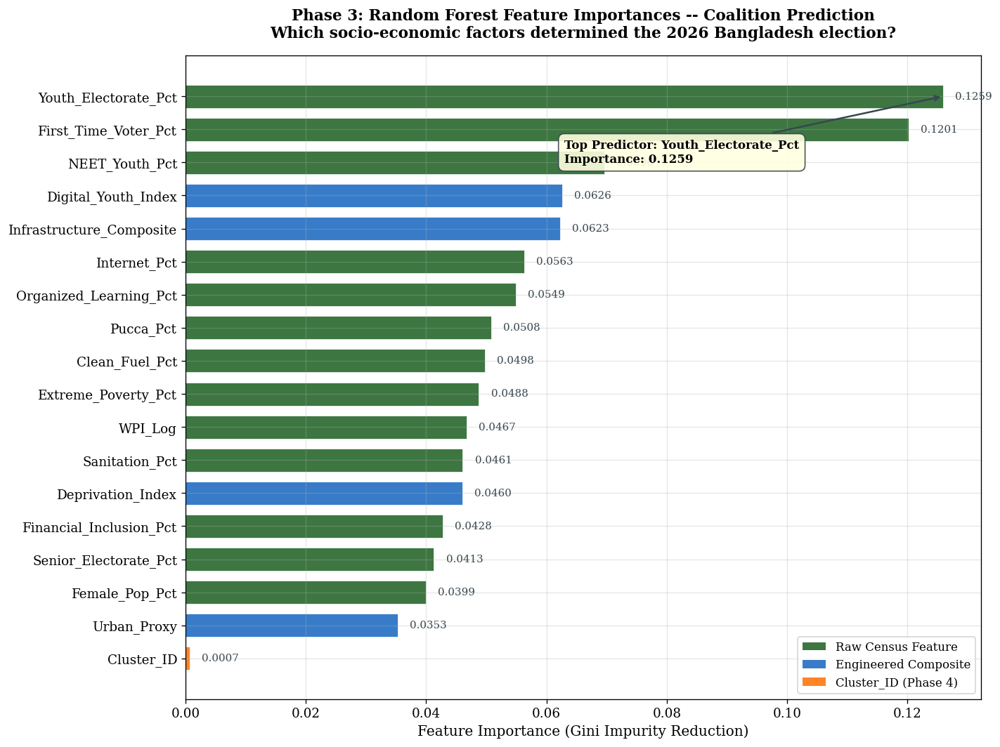

# 🇧🇩 2026 Bangladesh National Election Analytics
**Big Data Correlation & Predictive Analytics Using Apache Spark**

[](https://www.python.org/)
[](https://spark.apache.org/)
[]()
[]()

> **Note:** This repository was developed as the Term Project for **CSE488: Big Data Analytics** at East West University.

## 📖 Overview
This repository contains a comprehensive big data analytics pipeline for the 13th Bangladesh National Parliamentary Election (February 12, 2026), conducted concurrently with the July Charter constitutional referendum. 

Leveraging **Apache Spark, Spark SQL, and Spark MLlib**, this project integrates constituency-level election results with granular socio-economic indicators derived from the Bangladesh Bureau of Statistics (BBS) 2022 Population and Housing Census. The pipeline processes over 95,000 raw demographic records across four census dimensions, condensing them into 269 ML-ready constituency profiles via custom NLP geospatial mapping and K-Nearest Neighbors (KNN) imputation.

## ✨ Key Findings & Analytical Achievements

Our analytics pipeline uncovered deep structural determinants of electoral outcomes, challenging conventional political assumptions:

*   **Turnout Predictability:** Voter turnout is structurally determined by census data ($R^2 = 0.6302$ via ElasticNet Regression). In contrast, winning vote share reflects unpredictable campaign dynamics ($R^2 \approx 0$).
<p align="center">
  
</p>

*   **The Coalition-Referendum Cleavage:** We discovered a massive, statistically significant partisan divide ($p = 0.000781$) regarding the July Charter. Constituencies won by the BNP Coalition overwhelmingly voted **NO** on the constitutional referendum, while Jamaat/Reform constituencies heavily voted **YES**.
<p align="center">
  
</p>

*   **The Elite/Wealth Reversal ("Horseshoe" Pattern):** Uncovered a statistically confirmed U-shaped pattern where the Jamaat/Reform coalition drew identical high support (37.74%) from both the absolute poorest and the wealthiest quintiles of constituencies, bypassing the middle class.
<p align="center">
  
</p>

*   **Geopolitical Border Securitization:** Constituencies sharing an international border showed a massive surge in Jamaat/Reform support. The border proximity effect acts as a radicalizing factor completely independent of localized poverty metrics (Odds Ratio = 1.90).
<p align="center">
  
</p>

*   **The Digital Elitism Paradox:** Contrary to traditional assumptions, high internet penetration and digital infrastructure exhibited a strong predictive relationship favoring the Jamaat/Reform coalition, shattering the premise that digital literacy naturally favors traditional establishment parties.
<p align="center">
  
</p>

*   **The Internet-Turnout Suppressive Effect:** Internet penetration exhibits a strong negative correlation with voter turnout ($r = -0.5948$), acting as an electoral suppressive factor rather than an organizing catalyst.

*   **Youth as the Primary Determinant:** A Random Forest Classifier achieved **76.79\% accuracy (AUC: 0.7738)** in predicting coalition victory using only pre-election census data, identifying `Youth_Electorate_Pct` and `First_Time_Voter_Pct` as the dominant features.
<p align="center">
  
</p>

## 🛠️ Architecture & Tech Stack

*   **Distributed Processing Engine:** Apache Spark (PySpark)
*   **Machine Learning:** Spark MLlib (`RandomForestClassifier`, `KMeans`, `LinearRegression`, `VectorAssembler`), Scikit-Learn (`KNNImputer`)
*   **Data Engineering:** Spark SQL, Pandas, NLP String Matching (Geospatial Bridge)
*   **Visualization:** Matplotlib, Seaborn
*   **Documentation:** LaTeX (Standard Academic & IEEE Conference Formats)

## 📂 Repository Structure

```text
├── dataset/
│   └── grand_df_enriched.csv                  # The final ML-ready constituency dataset (269 rows, 18 features)
├── notebooks/
│   ├── 01_Data_Engineering_and_Imputation.ipynb
│   ├── 02_Exploratory_Data_Analysis.ipynb
│   ├── 03_Core_MLlib_Predictive_Pipeline.ipynb
│   ├── 04_Deductive_Hypothesis_Testing.ipynb
│   ├── 05_Advanced_Pattern_Discovery.ipynb
│   └── 06_Referendum_Analytics_and_Clustering.ipynb
├── reports/
│   ├── CSE488_Report.pdf                      # Comprehensive Term Project Report (15+ pages)
│   ├── CSE488_Report_IEEE.pdf                 # Condensed IEEE-Format Conference Paper
│   └── exported_plots/                        # High-resolution PNGs of all ML visualizations
└── README.md
```

## 🚀 Execution & Reproducibility

This pipeline is optimized for execution within a Google Colab environment to natively utilize PySpark distributed computing resources.
1. Upload the provided notebooks to Google Colab.
2. Mount Google Drive containing the raw `BBS_Census_2022.xlsx` and `EC_Results_2026.csv` files.
3. Execute the pipeline sequentially from Notebook 1 to 5.

## 👨‍💻 Authors & Contributions
*   **Md. Sadik Shahriar** (ID: 2023-2-60-103) - Data Engineering, ML Architecture, Predictive Modeling
*   **Sunzid Ashraf Mahi** (ID: 2023-1-60-148) - Geospatial Mapping, Data Visualization, EDA
*   **Abdullah Saleh Mahmud** (ID: 2023-1-60-215) - Hypothesis Formulation, Report Synthesis

---
*If you are an academic researcher or recruiter reviewing this repository, please review the `CSE488_Report_IEEE.pdf` for a rigorous mathematical breakdown of the classification weights and cluster silhouettes.*
